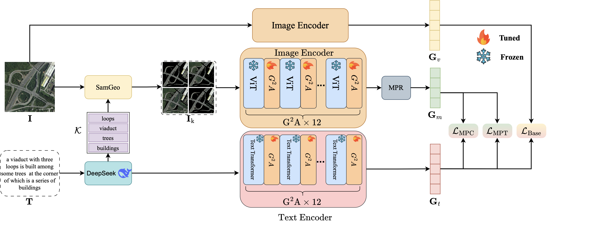
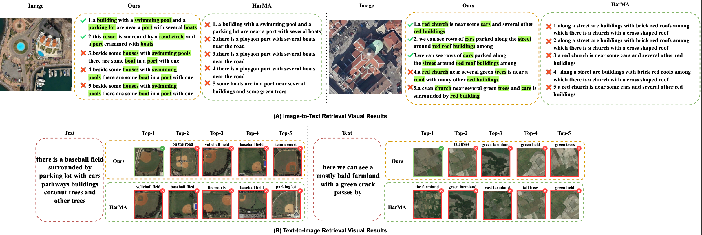
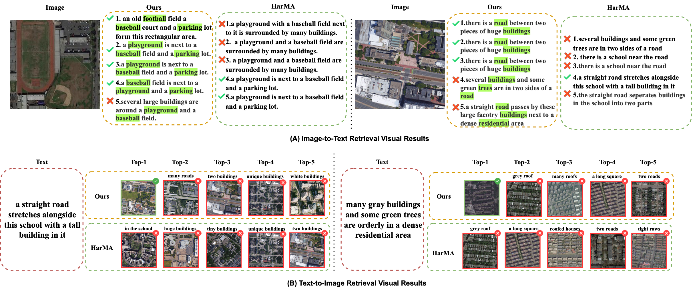
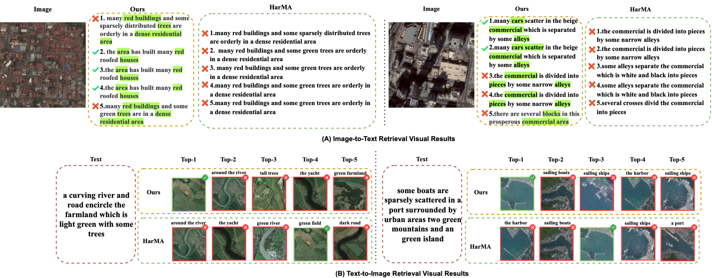

<div align="center">

# [ICME2026] MPS-CLIP
**Multi-Perspective Subimage CLIP with Keyword Guidance for Remote Sensing Image-Text Retrieval**

[](https://arxiv.org/abs/2601.18190)
[](https://lcrucial1f.github.io/)
[](https://huggingface.co/datasets/lcrucial1f/MPS-CLIP_Data/tree/main)

<p align="center">
  <a href="#-overview">Overview</a> •
  <a href="#%EF%B8%8F-visualization">Results</a> •
  <a href="#%EF%B8%8F-installation">Installation</a> •
  <a href="#-data-preparation">Data</a> •
  <a href="#-training">Training</a> •
  <a href="#-testing--evaluation">Testing</a>
</p>

</div>

---

## 📖 Overview

**MPS-CLIP** introduces a novel approach for Remote Sensing Image-Text Retrieval (RSITR) by leveraging multi-perspective subimages and keyword guidance to enhance feature alignment.

### The Pipeline
<div align="center">
  
</div>

---

## 🖼️ Visualization

Qualitative retrieval results on RSITMD and RSICD datasets.

<div align="center">
  
| **Retrieval Example 2** | **Retrieval Example 2** |
|:---:|:---:|
|  |  |

| **Retrieval Example 3** | **Retrieval Example 4** |
|:---:|:---:|
|  |  |

</div>

---

## 🛠️ Installation

Install dependencies:

```bash
pip install -r requirements.txt
```

The repository includes the MPS-CLIP retrieval model and its customized
`open_clip` implementation. No source files need to be copied from another
project.

---

## 📂 Data Preparation

We use RSITMD and RSICD datasets for all experiments.

**Download Data:**
Access the datasets and keyword-guided subimages via HuggingFace 🤗. The
annotations containing extracted nouns use the `*_train1.json` and
`*_test1.json` names in `data/finetune` and are selected by the default configs.

**Configure Paths:**
Place the data under the default relative paths below, or update the four root
fields in the corresponding YAML file:

```yaml
image_root: 'data/rsicd/images'
train_sub_root: 'data/rsicd/subimages/train'
val_sub_root: 'data/rsicd/subimages/test'
test_sub_root: 'data/rsicd/subimages/test'
```

Each subimage directory must follow this layout:

```text
subimages/train/<image_stem>/<noun>_blackbg.png
```

---

## 🚀 Training

**1. Download Pretrained Weights (GeoRSCLIP tasks only)**

* Download: `RS5M_ViT-B-32_RET-2.pt`
* Place in: `models/pretrain/`

The `*_vit` tasks use the OpenAI CLIP initialization. The `*_geo` tasks load
the GeoRSCLIP checkpoint configured by `pretrained_path`.

**2. Start Training**

`--dist fN` launches N processes on the GPUs visible through
`CUDA_VISIBLE_DEVICES`.

RSITMD Dataset:

```bash
CUDA_VISIBLE_DEVICES=0,1 python run.py \
  --task 'itr_rsitmd_vit' \
  --dist "f2" \
  --output_dir './checkpoints/MPS-CLIP/full_rsitmd_vit'
```

RSICD Dataset:

```bash
CUDA_VISIBLE_DEVICES=0,1 python run.py \
  --task 'itr_rsicd_vit' \
  --dist "f2" \
  --output_dir './checkpoints/MPS-CLIP/full_rsicd_vit'
```

---

## ⚡ Testing / Evaluation

Pass `--evaluate`; the launcher sets evaluation mode in the loaded config.

Evaluate on RSITMD:

```bash
python run.py \
  --task 'itr_rsitmd_vit' \
  --dist "gpu0" \
  --output_dir './checkpoints/MPS-CLIP/test' \
  --checkpoint './checkpoints/MPS-CLIP/full_rsitmd_vit/checkpoint_best.pth' \
  --evaluate
```

Evaluate on RSICD:

```bash
python run.py \
  --task 'itr_rsicd_vit' \
  --dist "gpu0" \
  --output_dir './checkpoints/MPS-CLIP/test' \
  --checkpoint './checkpoints/MPS-CLIP/full_rsicd_vit/checkpoint_best.pth' \
  --evaluate
```

---

## 🖊️ Citation

If you find this work useful for your research, please consider citing our paper:

```bibtex
@article{li2026mpsclip,
  title={Multi-Perspective Subimage CLIP with Keyword Guidance for Remote Sensing Image-Text Retrieval},
  author={Li, Yifan and Wang, Shiying and Huang, Jianqiang},
  journal={arXiv preprint arXiv:2601.18190},
  year={2026}
}
```
