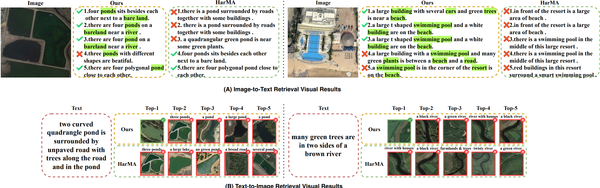

```md
<div align="center">

<!-- You can add a logo here later -->
<!--  -->

# MPS-CLIP

Multi-Scale Prompting for Remote Sensing Image-Text Retrieval with CLIP

[](https://arxiv.org/abs/2601.18190)
[](https://lcrucial1f.github.io/)
[](https://huggingface.co/datasets/lcrucial1f/MPS-CLIP_Data/tree/main)

**Model Pipeline:** [pipeline.png](assets/pipeline.png)

</div>

---

## Overview

### Pipeline

<p align="center">
  <a href="assets/pipeline.png">
    
  </a>
</p>

---

## Visualization Results (Paged Gallery)

Use the page buttons to “flip” between visualizations (GitHub README doesn’t support true carousels, so this is the cleanest native alternative).

<p align="center">
  <a href="#vis-1"><b>1</b></a> ·
  <a href="#vis-2"><b>2</b></a> ·
  <a href="#vis-3"><b>3</b></a> ·
  <a href="#vis-4"><b>4</b></a>
</p>

---

<a id="vis-1"></a>

### Page 1 / 4 — Visualization Summary

<p align="center">
  <a href="assets/visualiazation.png">
    
  </a>
</p>

<p align="center">
  <a href="#vis-4">Prev</a> | <a href="#vis-2">Next</a>
</p>

---

<a id="vis-2"></a>

### Page 2 / 4 — visual_2

<p align="center">
  <a href="assets/visual_2.png">
    
  </a>
</p>

<p align="center">
  <a href="#vis-1">Prev</a> | <a href="#vis-3">Next</a>
</p>

---

<a id="vis-3"></a>

### Page 3 / 4 — visual_3

<p align="center">
  <a href="assets/visual_3.png">
    
  </a>
</p>

<p align="center">
  <a href="#vis-2">Prev</a> | <a href="#vis-4">Next</a>
</p>

---

<a id="vis-4"></a>

### Page 4 / 4 — visual_4

<p align="center">
  <a href="assets/visual_4.png">
    
  </a>
</p>

<p align="center">
  <a href="#vis-3">Prev</a> | <a href="#vis-1">Next</a>
</p>

---

## Installation

### 1. Install Dependencies

```bash
pip install -r requirements.txt
```

---

## Prepare Data

All experiments are based on the **RSITMD** and **RSICD** datasets. Please refer to:

- Datasets (HuggingFace): https://huggingface.co/datasets/lcrucial1f/MPS-CLIP_Data/tree/main

After downloading and organizing the datasets, modify the corresponding `configs/yaml` file:

- For **RSICD**:
```yaml
image_root: 'YOUR_OWN_PATH/rsicd'
```

- For **RSITMD**:
```yaml
image_root: 'YOUR_OWN_PATH/rsitmd'
```

The annotation files for the datasets are located in the `data/finetune` directory.

---

## Training

### Step 1: Download Pretrained Weights (GeoRSCLIP)

Download the **GeoRSCLIP** pre-trained model from:

- https://huggingface.co/Zilun/GeoRSCLIP/blob/main/ckpt/RS5M_ViT-B-32_RET-2.pt

Place the checkpoint in:

```text
models/pretrain/
```

### Step 2: (Optional) Multi-GPU / Distributed Setup

If you encounter distributed environment issues, you can modify the `get_dist_launch` function in `run.py`. For example, for a 2-GPU setup:

```python
elif args.dist == 'f2':
        return "CUDA_VISIBLE_DEVICES=8,9 WORLD_SIZE=2 YOUR_OWN_PYTHON_PATH -W ignore -m torch.distributed.launch --master_port 25903 --nproc_per_node=2 " \
               "--nnodes=1 "
```

> Note: Remember to replace `CUDA_VISIBLE_DEVICES=8,9` with your own GPU IDs, and `YOUR_OWN_PYTHON_PATH` with your actual python executable path (e.g., `/root/miniconda3/bin/python`).

### Step 3: Start Training

```bash
python run.py --task 'itr_rsitmd_vit' --dist "f2" --config 'configs/Retrieval_rsitmd_vit.yaml' --output_dir './checkpoints/MPS-CLIP/full_rsitmd_vit'

python run.py --task 'itr_rsicd_vit' --dist "f2" --config 'configs/Retrieval_rsicd_vit.yaml' --output_dir './checkpoints/MPS-CLIP/full_rsicd_vit'
```

---

## Testing

Set `if_evaluation` to `True` in the corresponding `configs/yaml` file, then run:

```bash
python run.py --task 'itr_rsitmd_vit' --dist "f2" --config 'configs/Retrieval_rsitmd_vit.yaml' --output_dir './checkpoints/MPS-CLIP/test' --checkpoint './checkpoints/MPS-CLIP/full_rsitmd_vit/checkpoint_best.pth' --evaluate

python run.py --task 'itr_rsicd_vit' --dist "f2" --config 'configs/Retrieval_rsicd_vit.yaml' --output_dir './checkpoints/MPS-CLIP/test' --checkpoint './checkpoints/MPS-CLIP/full_rsicd_vit/checkpoint_best.pth' --evaluate
```
```
